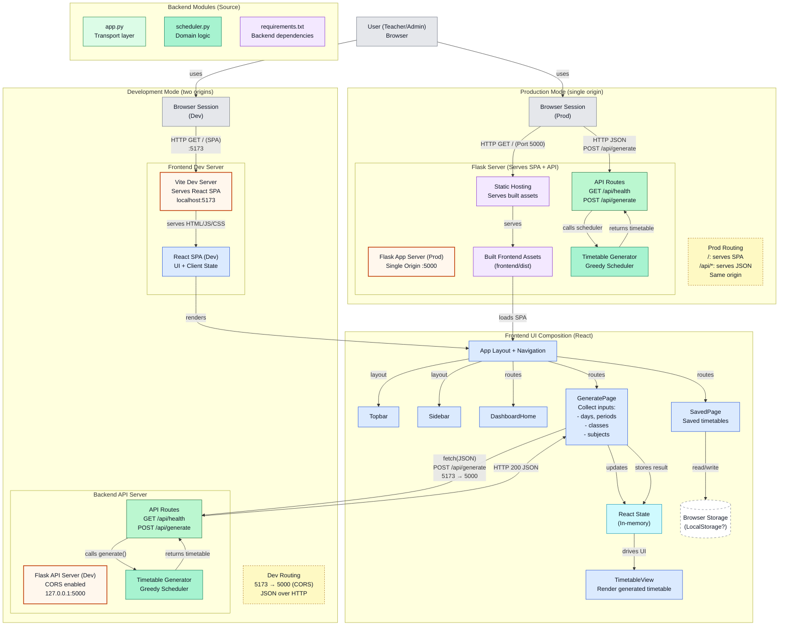

# 🗓️ Automatic Timetable Generator — Full Dashboard

A full-stack intelligent timetable generation system designed to automate school schedule planning using a constraint-aware greedy scheduling algorithm.

The backend is built using Flask, providing RESTful APIs for timetable generation, health monitoring, and data processing. The frontend is developed using React and Vite, offering an interactive dashboard where users can input class details, subjects, teachers, and scheduling constraints, and instantly visualize generated timetables.

The system demonstrates strong software engineering principles including separation of concerns, modular architecture, and efficient algorithmic scheduling logic. The project also supports production-style deployment where the React frontend is served as static assets through the Flask backend.

---

## 🏗️ System Architecture

The following diagram outlines the dual-mode operation of the system, illustrating how the **Vite Dev Server** interacts with the **Flask API** during development, and how they merge into a single origin for production.



---

## 🚀 Getting Started

### 1. Prerequisites

* Python 3.x
* Node.js & npm

### 2. Installation

```bash
# Clone the repository
git clone <your-repo-url>
cd automatic-timetable-full-dashboard

# Install backend dependencies
python -m venv .venv
source .venv/bin/activate  # Or .venv\Scripts\activate on Windows
pip install -r backend/requirements.txt

# Install frontend dependencies
cd frontend
npm install
cd ..

```

### 3. Start Development Servers

**Backend:**

```bash
.venv/bin/python backend/app.py

```

*Runs on: http://127.0.0.1:5000*

**Frontend:**

```bash
cd frontend
npm run dev

```

*Runs on: http://localhost:5173/*

---

## 🛠️ Build for Production

To serve the app as a single unit via Flask:

1. **Build Frontend:**
```bash
cd frontend
npm run build

```


2. **Run Flask:**
```bash
cd ..
.venv/bin/python backend/app.py

```


The Flask server will now serve the static files from `frontend/dist` at `http://127.0.0.1:5000`.

---

## 📡 API Endpoints

* `GET /api/health` — Service health check.
* `POST /api/generate` — Generate a timetable.

**Example Request Body:**

```json
{
   "days": ["Mon","Tue","Wed","Thu","Fri"],
   "periods_per_day": 6,
   "classes": ["Class A", "Class B"],
   "subjects": [
      {"name":"Math","teacher":"T1","periods_per_week":5},
      {"name":"English","teacher":"T2","periods_per_week":4}
   ]
}

```

---

## 📂 Files of Interest

* `backend/app.py`: Flask entry point and static file serving.
* `backend/scheduler.py`: The core Greedy Algorithm logic.
* `frontend/src/`: React source code (components and dashboard logic).

## 🆘 Troubleshooting

* **CORS Errors:** Ensure you are using the Vite server (5173) to access the UI during development; CORS is pre-configured in `app.py`.
* **Backend Not Starting:** Check if port 5000 is already in use by another process (like macOS AirPlay Receiver).
* **Process Management:** Use the provided `run` script to easily manage background processes.


**Would you like me to help you create a specific "Greedy Algorithm" explanation section to show off how the scheduling logic actually handles conflicts?**

```
